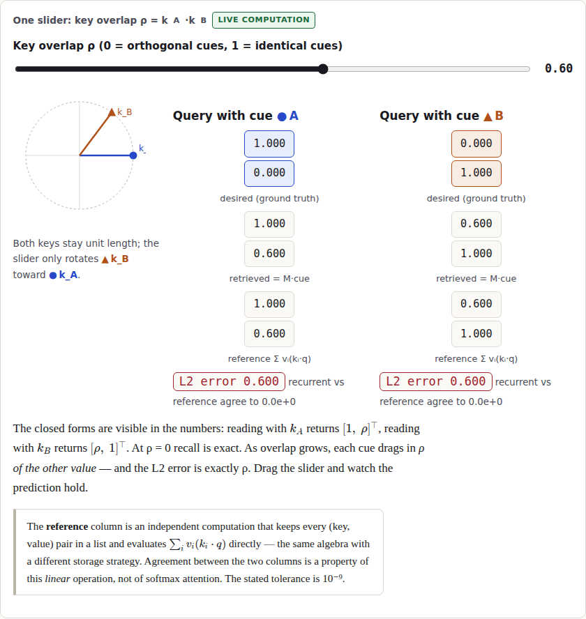

# Memory Under Pressure — How a Matrix Remembers and Interferes

An interactive, browser-only explainer of **associative memory and fast weights**, built for the **DataForge 2026 Pathway track**. A 2×2 **unnormalized additive associative memory** runs live on the page: you write two associations into it, read them back, watch interference appear as the cues collide — and then try to break the claim it makes. It connects the mechanism to **BDH (the Dragon Hatchling)** and **BDH-CQ**, but it is *not* softmax attention, *not* an official BDH model, and demonstrates nothing about trained BDH behavior.

**Audience:** undergraduate ML learners and working data scientists who know vectors, dot products, matrix multiplication and basic neural networks. Visual refreshers appear in the lesson where needed. No GPU, training, account or server required.

## Live demo

**<https://jainraunak944.github.io/Dataforge/>** — a static page, no sign-in; every displayed number is computed in your browser at interaction time. Deployed by the GitHub Pages workflow ([`.github/workflows/deploy.yml`](.github/workflows/deploy.yml)); the deployment verification record lives in [`submission/SUBMISSION_CHECKLIST.md`](submission/SUBMISSION_CHECKLIST.md).

Source repository: <https://github.com/jainraunak944/Dataforge>



*The heart of the lesson: ground truth, the recurrent read, and the independent explicit-history reference side by side, with the error the overlap predicts.*

## The claim this page lets you test

> For the additive memory in this explainer, storing two associations with orthogonal unit keys permits exact recall; increasing their key overlap introduces calculable interference while the recurrent matrix keeps the same shape and no trained parameters change.

The memory is `M_t = λ·M_{t−1} + v_t·k_tᵀ` with reads `retrieved(q) = M·q` (column vectors throughout). This fixed-size fast-weight state is the mechanism family behind linear attention, delta-rule architectures, BDH-GPU's state update and BDH-CQ's demonstration memory — and its price, interference, is exactly what the lesson has you produce, measure, and point at in a single matrix cell. The claim was written before the code; its full conditions, non-claims and refutation paths are in [`docs/CLAIM.md`](docs/CLAIM.md).

After the seven-step lesson a learner can:

1. Trace an outer-product write and a matrix–vector read.
2. Predict the retrieved value as two keys become more similar (leak = ρ · other value).
3. Distinguish temporary recurrent state from trained parameters.
4. Explain how fixed state size differs from unlimited recall capacity.
5. Identify the corresponding write/read in BDH-GPU (Eq. 8, arXiv:2509.26507), list the machinery the toy omits, and state BDH-CQ's distinct role (arXiv:2608.09888).

## Key features

- **Live writes and reads** — step or replay each outer-product write into the 2×2 matrix; every transition shown is a computed state, not an animation of one.
- **One concept variable** — the ρ slider sets the key overlap (cosine); recall error tracks it exactly, and the L2 error is displayed beside every read.
- **Truth beside estimate** — desired value, retrieved value and an independently coded explicit-history reference (`Σ λ^(t−i)·v_i·(k_i·q)`) rendered side by side, with their agreement stated to a 10⁻⁹ tolerance.
- **Point at the interference** — click matrix cells to decompose each one into A's and B's contributions and find the single number that leaks.
- **Sandbox with edge-case presets** — decay λ, repeated writes, and deterministic presets (orthogonal, partial, identical, repeated, decay) that each fully reset the state.
- **Tie reporting at ρ = 1** — identical cues are reported as an ambiguous tie, never resolved by an arbitrary argmax.
- **Honest memory accounting** — analytical slot/byte counts for the constant-size matrix vs the growing explicit history, with the caveats stated.
- **BDH / BDH-CQ module** — equation-level walkthrough of BDH-GPU's state update with a variable-role table and an explicit list of what the toy omits.
- **Predict-then-reveal quiz** — deterministic grading against a held-out setting; the reveal is a fresh live computation.
- **Shareable URLs** — settings mirror into the URL hash; out-of-range or malformed values in a shared link are normalized to the stated bounds instead of crashing or mislabeling the page.
- **Accessibility** — keyboard skip link, focus styles, `prefers-reduced-motion` support, shape+letter+color encodings (never color alone).

## Quick start

Requires **Node ≥ 20**.

```bash
git clone https://github.com/jainraunak944/Dataforge
cd Dataforge
npm ci          # install pinned dependencies (package-lock.json committed)
npm run dev     # local dev server; the printed URL opens the full lesson
```

Production build:

```bash
npm run build   # static site → dist/
```

For sub-path hosting (e.g. GitHub Pages), set the base path: `BASE_PATH=/Dataforge/ npm run build`.

## Testing and verification

```bash
npm run typecheck   # tsc --noEmit (strict)
npm test            # Vitest math/unit suite
npm run smoke       # browser checks against the built app (run npm run build first)
npm run pdfs        # regenerate submission PDFs from submission/src/
```

Each layer proves something different:

- **Unit tests** check the memory core against hand-calculated literals and the independent explicit-history reference — never against a second call to the implementation under test. They cover exact recall at ρ = 0, the closed-form interference, decay endpoints (including the λ⁰ = 1 convention at λ = 0), tie reporting, engine bounds, seeded recurrent-vs-reference equality, and normalization of out-of-range session and URL-hash parameters.
- **The browser smoke suite** drives the real built page in Chromium: it moves the slider and fails if any displayed number diverges from the closed form ("no painted values"), and also checks the ρ = 1 tie notice, keyboard focus, reduced motion, mobile overflow, URL sharing, an invalid shared-hash regression, and zero console errors. Results and screenshots land in `artifacts/` (the smoke needs a Chromium binary; `CHROMIUM_PATH` overrides the default).

Every scientific claim in the app has an exact section/equation locator into its primary source in [`docs/RESEARCH.md`](docs/RESEARCH.md).

## Built with

| Dependency | Role |
|---|---|
| [React](https://react.dev) 18 + [TypeScript](https://www.typescriptlang.org) | UI as a pure function of derived session state |
| [Vite](https://vitejs.dev) | dev server and static production build |
| [KaTeX](https://katex.org) | equation rendering (fonts under SIL OFL 1.1) |
| [Vitest](https://vitest.dev) | math/unit tests |
| [playwright-core](https://playwright.dev) | browser smoke test and PDF generation |

Versions are pinned in [`package.json`](package.json)/`package-lock.json`; the full origin/version/license table is in [`docs/PROVENANCE.md`](docs/PROVENANCE.md).

## Architecture

Concept variables (ρ, λ, repeats) are normalized to their stated bounds at the application boundary, then a pure `deriveSession()` computes everything the page shows, and React renders that state — so displayed and computed values cannot diverge. The memory engine (`src/memory/additiveMemory.ts`) never sees item identities or ground truth and throws on out-of-range input rather than silently clamping; the evaluator (`fixtures.ts` + `evaluate.ts`) holds the truth and computes errors. A deliberately separate explicit-history reference (`reference.ts`) provides the non-circular correctness check. Full explanation: [`docs/ARCHITECTURE.md`](docs/ARCHITECTURE.md).

| Component | Role |
|---|---|
| `src/memory/` | engine, independent reference, evaluator, fixtures, accounting, pure session derivation |
| `src/components/StoreTwoThings` | step 1 — writes as outer products, matrix timeline, Play/Pause/Step |
| `src/components/CollideCues` | step 2 — ρ slider, truth beside estimate, reference column, ρ=1 ambiguity |
| `src/components/CrossTerm` | step 3 — clickable cell decomposition; point at the interference |
| `src/components/WhatChanged` | step 4 — state vs activation vs convention vs (absent) trained weights |
| `src/components/BdhModule` | step 5 — BDH-GPU Eq. (8) walkthrough, variable-role table, omissions; BDH-CQ |
| `src/components/BreakTheClaim` | step 6 — presets, decay λ, repeated writes, honest memory accounting |
| `src/components/Comparison` | why-now table (delta-rule papers, BDH, BDH-CQ) |
| `src/components/ExplainItBack` | step 7 — predict → live reveal on held-out ρ, deterministic feedback |
| `tests/`, `scripts/smoke.mjs` | math tests against hand-calculated literals; browser checks |

## Scientific honesty and limitations

What is live, precomputed, synthetic, animated:

- **Live:** every displayed number (matrix cells, readouts, errors, scores, accounting, quiz reveal) is computed in the browser from the toy at interaction time; the smoke test fails if a displayed value diverges from the closed form.
- **Precomputed:** nothing — there are no shipped result files.
- **Synthetic:** the fixture vectors themselves (chosen, not learned) — stated in the lesson.
- **Animated:** only the write-stepping, which replays real computed matrix states and honors `prefers-reduced-motion`.
- **Source-derived (not ours):** BDH/BDH-CQ equations, transcribed with equation numbers. **Author-reported (labeled):** every benchmark number quoted. The toy is an original computation and **is not an official BDH model**.

The honest list of limitations:

- The toy teaches the mechanism, not trained behavior: nothing here demonstrates BDH's reported sparsity, monosemantic synapses, or performance — those are author-reported results of trained models, labeled as such.
- Raw readouts are scores, never probabilities; the recurrent≡explicit-history equivalence shown holds for this linear operation, not softmax attention.
- A constant-size recurrent state does not mean unlimited recall capacity — interference is the price, and the lesson shows it.
- Memory accounting is analytical (float64 slot counts), not measured GPU RAM; the teaching UI keeps extra bounded state beyond the 4-number model state.
- ρ = 1 leaves cue-based recall undecidable; the app reports the tie rather than resolving it.
- Sandbox caps (history ≤ 64 pairs, |components| ≤ 4, ρ and λ ∈ [0,1]) are stated in-app, and shared-URL values outside them are normalized to the same bounds.
- The 60-second learner protocol is **proposed**; no user study has been run yet ([`docs/LEARNER_TEST.md`](docs/LEARNER_TEST.md)).
- The interaction-latency measurement in the smoke log is machine-specific, not a device-independent guarantee.

## Documentation map

[`docs/CLAIM.md`](docs/CLAIM.md) (the claim, conditions, refutation paths) · [`docs/REQUIREMENTS.md`](docs/REQUIREMENTS.md) (brief→implementation matrix) · [`docs/RESEARCH.md`](docs/RESEARCH.md) (claim-to-source ledger) · [`docs/ARCHITECTURE.md`](docs/ARCHITECTURE.md) · [`docs/LEARNER_TEST.md`](docs/LEARNER_TEST.md) · [`docs/DEFENSE_GUIDE.md`](docs/DEFENSE_GUIDE.md) · [`docs/DEMO_SCRIPT.md`](docs/DEMO_SCRIPT.md) · [`docs/PROVENANCE.md`](docs/PROVENANCE.md) · [`docs/AI_DISCLOSURE.md`](docs/AI_DISCLOSURE.md) · [`submission/`](submission/) (concept summary PDF, blog PDF, checklist, manifest)

## Contributing

Issues and pull requests are welcome. The usual flow applies: fork, branch, make the change, and run the full verification (`npm run typecheck && npm test && npm run build && npm run smoke`) before opening a PR. Changes touching the memory math should extend the hand-calculated test fixtures rather than testing the implementation against itself, and must respect the honesty rules above (scores are never probabilities; ρ = 1 is a tie; the engine never sees ground truth).

## AI assistance disclosure

This project was built with **Claude Code** (Anthropic) as an implementation assistant directed by the team's written brief: it produced the application/test code, documentation and submission prose under that brief, and ran the live research-verification workflow that grounds every scientific claim in `docs/research-notes/` + [`docs/RESEARCH.md`](docs/RESEARCH.md). No external application code was reused or forked; the official BDH repo was read for convention-checking only. Full statement: [`docs/AI_DISCLOSURE.md`](docs/AI_DISCLOSURE.md).

## Credits and license

Original code and prose: MIT ([`LICENSE`](LICENSE)). BDH, BDH-CQ and all cited results belong to their authors — see the References section in-app and the ledger in [`docs/RESEARCH.md`](docs/RESEARCH.md). This project is independent and not affiliated with Pathway or the DataForge organizers.
